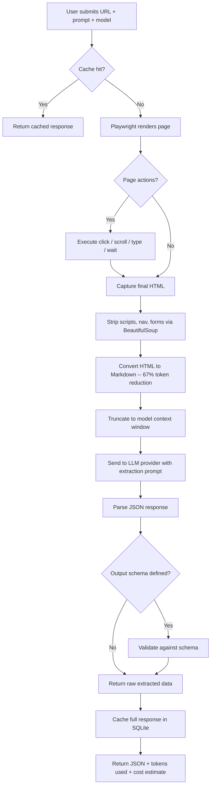

# AI Web Scraper

A full-stack application that extracts structured data from any website using AI. Users provide a URL and a natural language prompt describing what to extract; the system renders the page with Playwright, converts it to Markdown, sends it to the chosen LLM provider, and returns validated JSON.

## Architecture

The system is split into two independently deployed containers behind a Traefik reverse proxy:

- **Frontend** (Next.js 16) -- handles user input, model selection, API key entry, and result display with cost breakdown.
- **Backend** (FastAPI) -- manages sessions, rate limiting, browser pooling, HTML processing, multi-provider LLM dispatch, caching, and output validation.

The backend maintains a single persistent Chromium instance via `BrowserPool`. Each scrape request gets an isolated browser context (separate cookies and storage) to avoid cross-request leakage while skipping the 1-2s browser launch overhead. Stealth mode injects 59 anti-detection flags, blocks unnecessary resource types, and spoofs fingerprints.

```
frontend/                        backend/
  src/                             app/
    app/           (pages)           api/routes.py        (endpoints)
    components/    (UI)              core/config.py       (settings)
    hooks/         (state)           core/session_manager.py (rate limits)
    lib/api.ts     (HTTP client)     core/cache.py        (SQLite cache)
    types/         (TS defs)         core/url_validator.py (SSRF protection)
                                     models/schemas.py    (Pydantic models)
                                     services/scraper_service.py
                                       HTMLToMarkdown
                                       BrowserPool
                                       SmartRouter
                                       OutputValidator
                                       LLMProviders
```

## Pipeline



### Stage breakdown

1. **URL validation** -- Checks the target URL against SSRF rules before any network request.
2. **Cache lookup** -- SQLite-backed cache keyed on URL + actions + prompt + model. Configurable TTL (default 60 min).
3. **Page fetch** -- Playwright Chromium with optional stealth mode (webdriver spoofing, plugin emulation, CSP bypass, resource blocking, randomized user-agent and referer). Browser instance is pooled across requests; each request gets a fresh context.
4. **Page actions** -- Optional pre-scrape interactions: click a selector, scroll up/down, type into an input, or wait a fixed duration. Useful for SPAs and lazy-loaded content.
5. **HTML cleanup** -- BeautifulSoup removes script, style, nav, footer, header, aside, iframe, form, and other non-content tags.
6. **Markdown conversion** -- Markdownify converts the cleaned HTML to Markdown, reducing token count by approximately 67%.
7. **Content truncation** -- Content is truncated at a clean line boundary to fit within 80% of the model's context window, reserving space for the prompt and output.
8. **LLM extraction** -- The content and prompt are sent to the selected provider. All calls use retry with exponential backoff (3 attempts), except auth errors which fail immediately.
9. **Output validation** -- If an output schema was provided, the JSON result is validated for required fields and correct types.
10. **Cost estimation** -- Tokens are split 70/30 input/output and multiplied by the model's per-million pricing.

## Multi-Provider Support

Six providers are supported. Users supply their own API key per request (or the server can hold default keys for Groq and OpenAI).

| Provider | Models | API Key Format | Integration |
|----------|--------|---------------|-------------|
| Groq | Llama 3.3 70B, Llama 3.1 8B | `gsk_...` | OpenAI-compatible endpoint |
| OpenAI | GPT-5, GPT-5 Mini, GPT-5 Nano, GPT-4o, GPT-4o Mini | `sk-...` | Native OpenAI SDK |
| DeepSeek | DeepSeek V3.2 (Chat) | `sk-...` | OpenAI-compatible endpoint |
| Google | Gemini 2.5 Pro, Flash, Flash Lite | `AI...` | Google GenAI SDK |
| Anthropic | Claude Opus 4.6, Sonnet 4.6, Haiku 4.5 | `sk-ant-...` | Native Anthropic SDK |
| xAI | Grok 4, Grok 4 Fast | `xai-...` | OpenAI-compatible endpoint |

### Pricing tiers

| Tier | Models | Input / Output per 1M tokens |
|------|--------|------------------------------|
| Free | Llama 3.3 70B, Llama 3.1 8B | $0.00 / $0.00 |
| Budget | DeepSeek V3.2, Gemini Flash Lite, GPT-5 Nano, GPT-4o Mini, Grok 4 Fast | $0.10-$0.28 / $0.40-$1.50 |
| Standard | Gemini 2.5 Flash, GPT-5 Mini, Claude Haiku 4.5 | $0.30-$1.00 / $2.50-$5.00 |
| Premium | GPT-5, Gemini 2.5 Pro, Claude Sonnet 4.6, Grok 4, Claude Opus 4.6 | $1.25-$5.00 / $10.00-$25.00 |

Smart routing auto-selects the first model in a tier when `cost_tier` is set instead of a specific model.

## Tech Stack

| Component | Technology | Role |
|-----------|-----------|------|
| API server | FastAPI (Python 3.11) | Async REST API with Pydantic validation |
| Browser engine | Playwright Chromium | Headless rendering with stealth anti-detection |
| HTML processing | BeautifulSoup + Markdownify | Tag stripping and Markdown conversion |
| Cache | SQLite (via custom wrapper) | Persistent response cache with TTL |
| Session management | cachetools TTLCache | In-memory session store with auto-expiry |
| LLM clients | OpenAI SDK, Anthropic SDK, Google GenAI | Provider-specific API calls |
| Frontend framework | Next.js 16, React 19 | App Router with server components |
| Styling | Tailwind CSS 4 | Utility-first CSS |
| UI components | shadcn/ui | Accessible component library |
| Notifications | Sonner | Toast messages |
| Type safety | TypeScript | Frontend type definitions |
| Reverse proxy | Traefik v3 | TLS termination, routing, security headers |
| Containerization | Docker + Docker Compose | Multi-container deployment |

## Getting Started

### Prerequisites

- Docker and Docker Compose
- At least one AI provider API key (or use Groq free tier)

### Environment Variables

Backend `.env`:

```
DEBUG=false
MAX_CONCURRENT_SESSIONS=35
MAX_REQUESTS_PER_MINUTE=10
SESSION_TIMEOUT_MINUTES=30
MAX_SCRAPES_PER_SESSION=5
CACHE_DB_PATH=scrape_cache.db
FRONTEND_URL=http://localhost:3000
# DEFAULT_GROQ_API_KEY=gsk_...
# DEFAULT_OPENAI_API_KEY=sk-...
```

Frontend (build arg or `.env.local`):

```
NEXT_PUBLIC_API_URL=http://localhost:8000
```

### Running with Docker

```bash
docker compose up -d
```

The compose file builds both containers. The frontend waits for the backend health check before starting. Access the UI at the frontend URL and the interactive API docs at `{backend_url}/docs`.

### Running locally (without Docker)

Backend:

```bash
cd backend
python -m venv venv && source venv/bin/activate
pip install -r requirements.txt
playwright install chromium
uvicorn app.main:app --reload --port 8000
```

Frontend:

```bash
cd frontend
npm install
npm run dev
```

## API Reference

| Method | Endpoint | Description |
|--------|----------|-------------|
| `GET` | `/api/v1/health` | Server status, active sessions, version, enabled features |
| `POST` | `/api/v1/session` | Create a new session |
| `GET` | `/api/v1/session/{id}` | Get session info (request count, scrape count) |
| `DELETE` | `/api/v1/session/{id}` | End a session |
| `POST` | `/api/v1/scrape` | Execute a scrape request |
| `GET` | `/api/v1/models` | List all available models with pricing |
| `GET` | `/api/v1/examples` | List pre-cached example scrapes |

### POST /api/v1/scrape

Request body:

```json
{
  "url": "https://example.com",
  "prompt": "Extract all product names and prices",
  "model": "deepseek-chat",
  "api_key": "sk-...",
  "stealth_mode": true,
  "use_markdown": true,
  "use_cache": true,
  "cache_ttl_minutes": 60,
  "cost_tier": "budget",
  "actions": [
    {"action": "scroll", "value": "down", "wait_ms": 1000},
    {"action": "click", "selector": ".load-more", "wait_ms": 2000}
  ],
  "output_schema": [
    {"name": "products", "type": "array", "required": true},
    {"name": "total_count", "type": "number", "required": true}
  ]
}
```

Response includes: extracted `data`, `tokens_used`, `estimated_cost`, `cache_hit`, `token_reduction` percentage, `validation_passed`, timing breakdown (`fetch_time`, `parse_time`, `llm_time`), and `scrapes_remaining`.

## Rate Limits

| Control | Value |
|---------|-------|
| Max concurrent sessions | 35 |
| Max requests per minute per session | 10 |
| Max scrapes per session | 5 (pre-cached examples do not count) |
| Session timeout | 30 minutes of inactivity |
| Default cache TTL | 60 minutes |

## License

MIT
